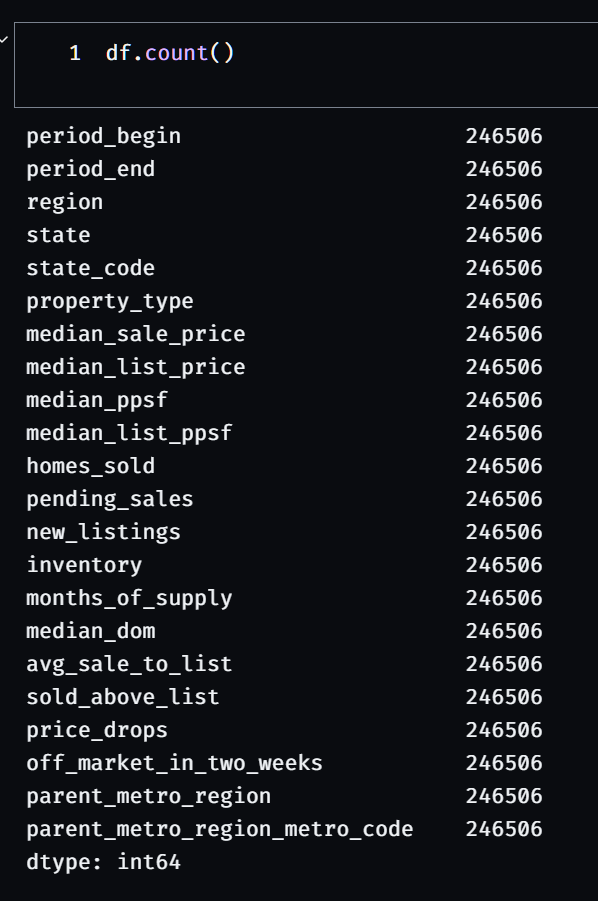

# project_2

## Extract

We looked to make a connection between housing prices and COVID-19 rates. We sourced 2 data sets, one containing COVID-19 stats on a daily basis and the other containing housing prices during the same time period. THe housing statistics were from every 30 days. 

[COVID-19 data source](https://github.com/nytimes/covid-19-data)
Our COVID-19 data was a CSV from the New York Times. 

[Housing Prices source](https://www.redfin.com/news/data-center/)
Our housing cost prices were sourced from Redfin Real Estate News. This file was a TSV 

The link we aimed to connect was "as covid rates increased, how did the housing market fluctuate?" Although they are not directly correlated, having the data together gives us the ability to display trends between the two.

## Transform

### Charles: Redfin Data

To clean the housing data from Redfin, we needed a way to open up the tab separated values file and interact with the data. Attempting to open the data in Excel was not feasible - there were *over 50,000 rows and 58 columns* of information to work with. The best solution we came up with was to use Pandas in a Jupyter Notebook to read the TSV. 

Reading a TSV file in Pandas required us to use the Pandas read_csv function, using “\t” (tabs) as the separator. We knew we wanted to first clear out any rows that had null values. However, because we were interested in county-level data, the housing information we obtained had the entire “city” column filled with null values, meaning we needed to drop that column first before dropping all rows with null values.

Since we also needed to drop other columns that did not make sense to keep (such as internal id columns, repetitive columns, year-over-year or month-over-month columns), we dropped all of those columns prior to dropping the rows with null values.

After dropping rows with null values, we should expect to see each column contain the same number of rows.

To prepare the data for importing into our Postgresql database, I had to make sure the data types we expected our columns to be aligned with the data types stored in the Pandas data frame. Several columns we expected to have integer values ended up being read as floats, so we adjusted those data types (and also changed columns we would rather have as whole numbers, such as the price per square foot). 

In the process of importing the data into the Postgresql database, we kept encountering edge case errors when trying to reconcile the counties contained in this TSV file against the list of counties we obtained from another data source. We fixed those edge cases by adding or changing the region appropriately. 

We then exported this data as a csv file (compressed into a ZIP file in the repository).

Covid_Counties Data:

I did something similar to Charles’ transformation in pandas. I imported a zipped csv, created a new column, [‘region’], that will be our foriegn key in our relational database. Also like Charles, we encountered a few edge cases of regions not lining up due to minor differences or in some cases regions not existing in the county master list. Those edge cases were either changed to match appropriately or removed. Examples of cases removed were all Puerto Rico and Virgin Island rows from the Covid data. I then saved the new dataframe as a zipped csv file. You can refer to the covid_data_cleaning.ipynb file to see how this was accomplished.

## Load

We loaded the files on PostgreSQL using pgAdmin. For each dataset we made a table, one called “Covid_Counties” and another called “Redfin”. We used an ERD editor to build our schema. Our ERD consisted of 2 tables with all the attributes/rows of each cleaned file. After importing the ERD into pgAdmin, the only task left was to import the files into our database. During the import we had to make sure the attributes had correct data types aligned with it otherwise the import would fail. 
